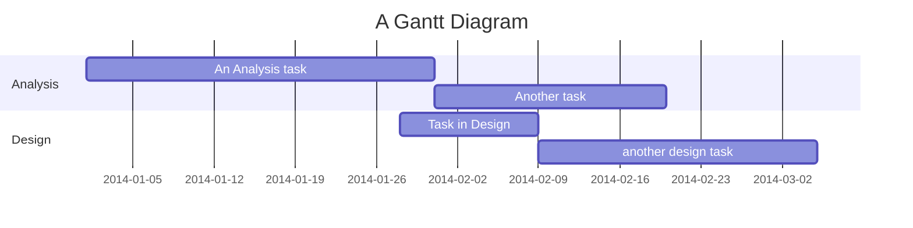

# Project Management Strategies

## Overview

Effective project management is essential for delivering successful data projects. This section covers planning techniques, Gantt charts, and tracking progress.

## Key Concepts

- **Gantt Charts**: Visualizing tasks and timelines.
- **Milestones**: Setting key goals and deadlines.
- **Critical Path**: Identifying the tasks which can run concurrently and which tasks will delay the whole project if they are delayed themselves
- **Risk Management**: Identifying and mitigating project risks.

## Learning Resources

- [Gantt Chart Basics](https://www.smartsheet.com/gantt-chart)

## Example Exercises

### Exercise 1: Creating a Gantt Chart

- Create a simple Gantt chart for a data analysis project using Excel or Google Sheets.

### Exercise 2: Identifying Project Risks

- List potential risks for a data visualisation project and propose mitigation strategies.

