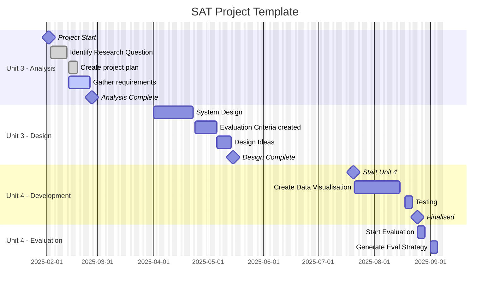

# Project Management Strategies

## Overview

Effective project management is essential for delivering successful data projects. This section covers planning techniques, Gantt charts, and tracking progress. Lots of our focus for the project management is on tracking the progress of our SAT project and associated tasks.

## Key Concepts

- **Gantt Charts**: Visualizing tasks and timelines.
- **Milestones**: Setting key goals and deadlines.
- **Critical Path**: Identifying the tasks which can run concurrently and which tasks will delay the whole project if they are delayed themselves. The critical path is the set of tasks which will delay the whole project if they are delayed
- **Risk Management**: Identifying and mitigating project risks.

## Project Management in the Study Design

### Unit 3 Outcome 2

**Key Knowledge:**

- features of project management to develop a project plan using Gantt charts, including:
  - identification of tasks
  - sequencing of tasks
  - time allocation
  - dependencies
  - milestones
  - critical path
  - monitoring and documenting the progress of projects

**Key Skills:**

- create, monitor and modify project plans using software

### Unit 4 Outcome 1

**Key Knowledge:**

- techniques for recording the progress of projects, including:
  - adjustments to tasks
  - adjustments to time frames
  - annotations to project plans
  - monitoring and documenting progress using logs/journals
- techniques for assessing the effectiveness of a project plan, including:
  - reviewing the number of changes made to the project plan during the project
  - the reason changes were necessary
  - the impact of changes on the completion of the project.

**Key Skills:**

-	monitor, modify and annotate project plans as necessary
- assess the effectiveness of the project plan

*Study design key knowledge and key skills are taken verbatim from the VCE Applied Computing Study Design 2025-2028.*
**© Victorian Curriculum and Assessment Authority. For current versions and related content visit [www.vcaa.vic.edu.au](https://www.vcaa.vic.edu.au)**

## Learning Resources

- [Gantt Chart Basics](https://www.smartsheet.com/gantt-chart)

## Examples

### Example 1: Creating a Gantt Chart

- Create a simple Gantt chart.

### Example 2: Identifying Project Risks

- List potential risks for a data visualisation project and propose mitigation strategies.

